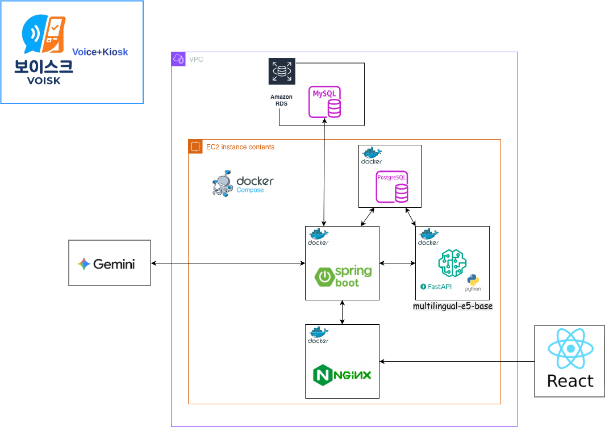

# Voisk(보이스크) — Backend

> 시각장애인을 위한 **AI 기반 카페 음성 주문 어시스턴트**의 Spring Boot 백엔드 서버

<p>
  
  
  
  
  
  
</p>

> '보이스크'는 **Voice**(음성)와 **Kiosk**(키오스크)를 합친 이름으로, 화면 대신 목소리로 주문하는 키오스크를 지향합니다.

---

## 📌 프로젝트 소개

시중의 카페 키오스크는 대부분 터치스크린 기반이라 **시각장애인이 독립적으로 주문하기 어렵다**는 한계가 있습니다.

**Voisk**는 사용자가 자연어로 말하면(`"아이스 아메리카노 주세요."`) 시스템이 **TTS 음성**으로 대화를 통해 주문까지 완결하는 음성 주문 어시스턴트입니다.

> 본 레포지토리는 **추천 · 주문 대화 상태머신 · 세션 관리**를 담당하는 **백엔드(Spring Boot)** 서버입니다. 프론트엔드·임베딩(FastAPI) 서버는 별도 레포지토리로 운영됩니다.

**핵심 사용자 흐름 (데모)**

```
NFC 태깅 → 환영 인사(TTS) → 사용자 발화(STT) → 메뉴 추천 → 주문 확인 → 완료
```

---

## ✨ 주요 기능

| 기능 | 설명 |
|---|---|
| **메뉴 추천** | 자연어 발화 기반 메뉴 추천. 메인은 하이브리드 구조(임베딩 top-K → LLM 재랭킹), 비교·측정용으로 임베딩 단독·LLM 단독·룰베이스 엔드포인트 구현 |
| **추천 힌트** | 사용자의 메뉴 추천을 돕는 힌트를 제공. 임베딩을 쓰지 않는 사전 매핑 기반으로 동작 |
| **대화형 주문** | 주문 상태머신. 키워드 fast-path + LLM slot filling으로 메뉴·옵션·수량을 채워 주문 완성 |
| **주문 세션 관리** | 발화 간 주문 맥락 유지. 최초 요청 시 `sessionId` 자동 발급, 이후 대화에서 상태 추적 |

### 임베딩 서버(FastAPI) 연동

백엔드는 사용자 발화를 임베딩 서버(`:8000`)로 보내 벡터를 받고, **pgvector** 코사인 유사도로 후보 메뉴를 검색합니다. 검색된 후보만 Gemini에 넘겨 재랭킹함으로써 전체 메뉴를 LLM에 넣는 방식 대비 **비용·지연을 억제**하면서 정확도를 유지합니다.

---

## 🛠 기술 스택

| 구분 | 기술 |
|---|---|
| **언어** | Java 17 |
| **프레임워크** | Spring Boot 4.0 |
| **데이터베이스** | MySQL (메뉴·주문·세션) · PostgreSQL/pgvector (임베딩 벡터) |
| **LLM** | Google Gemini (`gemini-2.5-flash`) |
| **임베딩** | 별도 Python FastAPI 임베딩 서버 (`EMBED_MODEL` env로 선택, 기본 `e5-base` · `ko-sroberta` 지원) |
| **API 문서** | springdoc-openapi (Swagger UI) |
| **빌드 / 배포** | Gradle, Docker / Docker Compose (postgres · fastapi · springboot · nginx) |

> **이중 DataSource** 구조입니다. MySQL은 원본 데이터, PostgreSQL/pgvector는 임베딩 벡터만 저장하며, pgvector 컨테이너가 유실되어도 MySQL 데이터로 임베딩을 재생성할 수 있습니다.

---

## 🏗 시스템 아키텍처



단일 EC2 인스턴스에서 Docker Compose로 **Nginx · Spring Boot · FastAPI(임베딩) · PostgreSQL(pgvector)** 4개 컨테이너를 구동합니다. 외부 요청은 Nginx가 HTTPS로 받아 Spring Boot로 프록시하고, 백엔드는 발화를 FastAPI 임베딩 서버에 전달해 벡터를 받은 뒤 pgvector에서 유사 메뉴를 검색하며, 추천·재랭킹은 외부 Gemini API로 처리합니다. 복구 불가능한 **원본 데이터(메뉴·주문·세션)는 Amazon RDS(MySQL)**, 원본으로 재생성 가능한 **임베딩 벡터는 EC2 내 컨테이너(pgvector)** 에 두어 내구성과 비용 효율을 함께 확보했습니다.

---

## 📁 프로젝트 구조

```
backend/voisk/                       # Gradle 프로젝트 루트
└── src/main/java/capstone2/voisk/
    ├── controller/   # 주문 REST 컨트롤러
    ├── recommend/    # 추천 컨트롤러 · 서비스 (펀넬/임베딩/LLM/룰/힌트)
    ├── service/      # 주문 비즈니스 로직 (상태머신, 슬롯 필링, 세션)
    ├── embedding/    # 임베딩 클라이언트 · pgvector 연동 · 초기화
    ├── entity/       # JPA 엔티티 (Menu, Order, OptionGroup 등)
    ├── repository/   # Spring Data JPA 리포지토리
    ├── dto/          # 요청/응답 DTO
    ├── converter/    # 엔티티 ↔ DTO 변환
    ├── config/       # DataSource · Gemini · Swagger · Web 설정
    └── exception/    # 전역 예외 처리
```

- **메뉴 도메인**: `Category → Menu → MenuOptionGroup → OptionGroup → OptionItem`
- **주문 도메인**: `OrderSession → OrderMenu → OrderMenuOption`

---

## 🌐 API 개요

Base path: `/api` · 전체 명세는 실행 후 Swagger UI(`/swagger-ui.html`)에서 확인할 수 있습니다.

> 프론트엔드는 메인 추천(`/recommend`)과 힌트(`/recommend/hints*`)만 호출합니다. 나머지는 방식 비교·측정용 엔드포인트입니다.

| 리소스 | Endpoint | 설명 |
|---|---|---|
| 추천 | `POST /api/recommend` | **메인 추천 (하이브리드 방식)** |
| 추천 | `POST /api/recommend/embedded` | 임베딩 코사인 단독 (비교용) |
| 추천 | `POST /api/recommend/llm` | LLM(Gemini) 단독 |
| 추천 | `POST /api/recommend/rule` | 룰베이스 키워드 사전 (근거 반환) |
| 힌트 | `GET /api/recommend/hints` · `POST /api/recommend/hints/{hintId}` | 추천 힌트 버튼 · 사전 매핑 추천 |
| 주문 | `POST /api/order/speak` | 주문 대화 처리 (발화 → 상태 갱신) |
| 주문 | `POST /api/order/option-selection` | 세션 내 옵션 변경 |
| 주문 | `GET /api/order/menus/{menuId}/...` | 메뉴 옵션·설명 조회 |

---

## ⚙️ 핵심 동작

**추천 — 하이브리드 펀넬**: ① 발화를 임베딩 서버로 보내 pgvector 코사인 유사도로 후보 top-K(기본 20) 추림 → ② 추린 후보만 Gemini로 재랭킹(LLM은 menuId만 선택, 이름·가격은 DB 원본값 사용)

**주문 — 상태머신**: `ORDERING → MENU_CONFIRMING → [OPTION_FILLING] → CONFIRMING → DONE`

---

## 👥 팀

**캡스톤디자인 — Voisk(보이스크)**

| 이름 | 역할 |
|---|---|
| 박시윤 | Backend (Spring Boot) |
| 조영찬 | Backend (Spring Boot) · AI |
| 이성재 | Frontend |

---

## 🔗 프로젝트 레포지토리

전체 서비스(백엔드 · 프론트엔드 · 임베딩 서버)는 다음 조직에서 관리됩니다.

**https://github.com/Capstone06-Team02**
</content>
